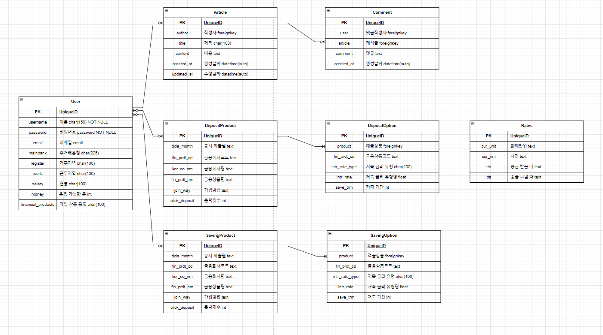

# 관통 프로젝트

## 팀원 정보 및 업무 분담 내역
- 김미량(팀장)
    - front
    1. 회원가입, 로그인, 로그아웃
    2. 게시판- 생성, 수정, 삭제
    3. 프로필 - 기본정보, 상품 목록, 추천
    근처 은행 찾기 Map
    4. 금융 상품 추천 알고리즘
    - back
    1. api 데이터 요청
    2. 데이터 수정, 삭제, 업데이트 요청 처리
    ---
- 박소정(팀원)
    - front
    1. 예금 / 적금 상품 목록
    2. 필터 및 정렬
    3. 환율 계산기
    4. 챗봇 프로그래밍
    - back
    1. 1:N, M:N 관계 설정 및 연결
    2. Front로 데이터 전송
---
## TimeLine
- 05.16~05.17
    - ERD 설계, 컴포넌트 구성, API 데이터 요청 및 저장
- 05.17~05.18
    - 게시글/댓글, 예금/적금 데이터 합치기
- 05.19~05.20
    - 환율계산기, Vue 업데이트, Django DB 반영, User 정보 업데이트, 회원가입
- 05.20
    - 카카오맵, 예금/적금 상품목록, 프로필, 상품 Detail
- 05.21~05.22
    - 금융상품 추천 알고리즘, 그래프, 필터 및 정렬기능, 환율계산기
- 05.22~05.23
    - CSS 및 PPT 마무리
---

## 데이터베이스 모델링(ERD)

---
##  금융 상품 추천 알고리즘에 대한 기술적 설명

#### 클릭 수 기반 추천 알고리즘
1. 상품 별로 User들이 해당 상품을 클릭한 횟수를 DB에 저장
2. 예금/ 적금으로 나누어 필터 기능으로 가장 클릭 수가 많은 5개의 상품을 추천
3. 단, User가 이미 가입한 상품이라면 이를 제외하고 추천하도록 구현
---
## 서비스 대표 기능들에 대한 설명

#### 예금 & 적금 금리 비교
- 전체 상품 조회
1. 토글 버튼으로 예금 / 적금 상품 확인
2. 특정 은행 조회 필터 구현
3. 은행명과 상품명에 따른 정렬 속성 추가
4. 상품 카드 마우스 오버

- 상품 상세 조회
1. 상세보기 클릭 시 상세 정보 페이지로 이동
2. 가입 여부에 따라 버튼 토글
3. 하나의 상품에 대한 여러 옵션 출력
4. 상품 카드 마우스 오버  

    ---
#### 환율 계산기
1. 해당 날짜의 환율 데이터를 활용하여 계산기 기능 구현
2. 한국 원 <-> 외국 통화, 외국통화<->외국통화의 환전 계산  

    ---
#### 근처 은행 검색
1. 주소 입력 시 근처 은행 검색 기능, '현재 위치 보기' 기능 추가 구현
2. 존재하지 않는 주소 및 근처에 입력 은행이 없을 경우 작성 시 오류 메시지 출력  

    ---
#### 커뮤니티(게시판)
1. 내가 쓴 글 페이지 추가
2. 작성자에 따른 버튼 토글
3. 게시글 생성, 삭제, 수정
4. 댓글 생성, 삭제  
    
    ---
#### 프로필 페이지
- 기본정보
1. 기본 정보 확인 폼
2. 기본 정보 수정 폼
- 가입된 상품 목록 조회
1. 가입 상품 목록 확인, 가입 취소 버튼
2. 예금/ 적금 별 금리 그래프 출력  

---
## 느낀 점
- 김미량
-SSAFY에서의 1학기가 너무 순식간에 지나간 것 같습니다. 
처음에는 이런 프로젝트를 제가 할 수 있을거라고 생각도 못했는데 이렇게 완성된 결과물을 보고 나니 뿌듯한 마음이 들었습니다. 
한 학기 동안 좋은 사람들과 좋은 환경에서 공부하며 많이 성장했습니다. 
그렇기에 2학기의 프로젝트들이 더 기대됩니다!

- 박소정
-처음에는 짧은 프로젝트 기간에 필수 기능들을 어떻게 구현하지?라는 막막함이 있었습니다. 한 학기 동안 하루하루 뭘 배우는거지?싶었는데 이 프로젝트를 하면서 웹사이트 하나를 만들 수 있는 학습과정을 밟았었구나라는 생각이 들었습니다. 시간이 좀 더 있었더라면... 이라는 아쉬움이 있지만 6개월 전만 해도 아무것도 못하던 제가 지금은 웹사이트를 조금이나마 구현할 수 있다는 게 뿌듯합니다.